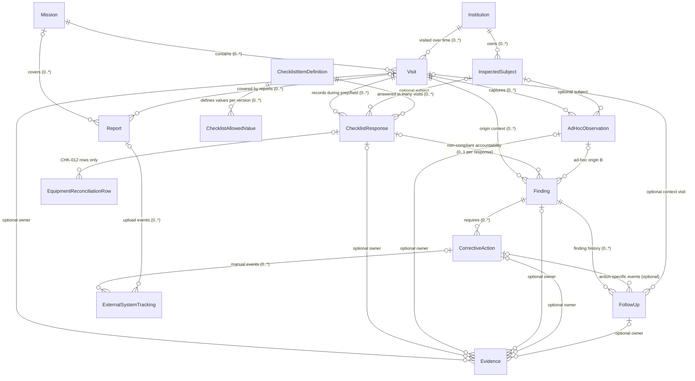

# نموذج البيانات المنطقي لتفتيش المفتش الميداني (Logical Data Model) — v1

> **الإصدار:** v1 · **المرحلة:** البوابة الثالثة — تصميم نموذج البيانات المنطقي لنسخة المفتش الميداني الأولى (MVP).
> **النطاق:** نموذج منطقي فقط — **لا** مخطط قاعدة بيانات فيزيائي، **لا** SQL/مigrations، **لا** JSON schema، **لا** واجهات، **لا** كود، **لا** تصدير/تقارير.
>
> **المراجع المعتمدة:**
> - كتالوج المتطلبات = `docs/requirements/REQUIREMENTS-v1.md` (31 DIRECT + 11 DERIVED + 9 PROJECT).
> - محاور التفتيش = `docs/requirements/INSPECTION-DOMAINS-v1.md` (DOM-01..DOM-16 وقرارات مالك المشروع الخمسة).
> - نموذج البند = `docs/checklists/CHECKLIST-MODEL-v1.md` · القائمة الرئيسية = `docs/checklists/FIELD-CHECKLIST-v1.md` (CHK-001..CHK-024) وقرارات المراجعة البشرية للبوابة الثانية (A..E).
> - المصدر 1 = `sources/01_field_control_and_equipment_aug_2026.md` · المصدر 2 = `sources/02_provincial_entry_readiness_committee_2026_2027.md`.
>
> **ملخص الأعداد:** **15 كيانًا منطقيًا — كلها P0** (نسخة المفتش الميداني الأولى). كيان `Report` (بيانات تعريفية للتقرير الميداني) **P0** لأن PRJ-07/PRJ-08/PRJ-09 متطلبات P0 — دون توليد DOCX/PDF في هذه البوابة (بوابة تنفيذ لاحقة)، ودون قدرات التقرير الولائي التجميعي (P1 حيث مصدرها P1). التفاصيل الحرفية لكل سمة في `docs/data-model/ENTITY-CATALOG-v1.md`؛ هذا الملف يعرّف الكيانات والعلاقات والدورة الحياتية والقواعد.

---

## 1) الغرض والنطاق

- الهدف: نموذج منطقي يحفظ **دورة الحياة الكاملة لمعلومة التفتيش** من المهمة إلى الإقفال، مع الحفاظ على حقيقة الملاحظة الميدانية التاريخية وعدم إعادة كتابتها.
- السلسلة التشغيلية المحفوظة:
  `Mission → Visit → Institution / Inspected Subject → Checklist Response / Ad-hoc Field Observation → Finding → Evidence → Corrective Action → Follow-up / Closure`
- يُراعى في النموذج أيضًا: تتبع الأنظمة الخارجية («تسيير» ومنصة التفتيش)، وبيانات تعريف التقارير المولّدة، وإمكان التجميع المستقبلي (DOM-01/DER-09) **دون تنفيذه الآن**.
- «Mission» في هذا النموذج هي وعاء تشغيلي يجمّع الزيارات في حملة/دورة عمل واحدة ذات مرجع زمني خاص بها (مثل حملة جاهزية الدخول التكويني لدورة أكتوبر 2026). المفهوم مطلوب صراحةً في هذه البوابة ويُسجَّل في MVP (إنشاء مهمة)؛ لا يُضاف أي كيان تخميني آخر.

### انحرافات عن الشكل المرجعي (مبرَّرة من المتطلبات المعتمدة)

| الاقتراح المرجعي | ما اعتُمد | التبرير |
|---|---|---|
| Institution و Inspected Subject ابنا Visit مباشرةً | Institution كيان مرجعي مستقل، و Visit يُسجَّل على مؤسسة واحدة؛ و Inspected Subject كتالوج تابع للمؤسسة، وتشير إليه الاستجابات/المعاينات داخل الزيارة | REQ-001 (رقابة مستمرة من سبتمبر 2026) وREQ-009 («كل المؤسسات») وREQ-019 (جاهزية فضاءات) تعيد زيارة نفس الورشة/الفضاء عبر زيارات متعددة؛ فالكائن المادي يسبق الزيارة ولا يُولَد منها. |
| Observation وسيط إلزامي قبل كل نقص | مصدر النقص إما استجابة غير مطابقة لبند أو معاينة ميدانية مباشرة (ad-hoc)؛ الاستجابة غير المطابقة ترتبط مباشرة بنقص (قرار المراجعة 4) | قرارا البوابة الثانية (تصحيح 3 و4): لا يُشترط بند لكل نقص، وكل نتيجة غير مطابقة يجب أن تُربط بنقص منشأ أو قائم. |
| Finding مرجع اختياري لبند واحد | إسناد الاستجابة غير المطابقة إلى نقص واحد على الأكثر (0..1 لكل استجابة) مع سماح نقص واحد بتغطية عدة استجابات | في v1 تُجاب البنود لكل وحدة/موضوع، فكل نتيجة غير مطابقة تعبّر عن مسألة واحدة؛ وإذا غطّى نقص قائم نفس المسألة عبر وحدات متعددة تُربط به كل الاستجابات. إن لزم لاحقًا تقسيم استجابة واحدة على عدة نقائص، يُعاد النظر في هذه القاعدة (قرار/مراجعة). |
| أدلة حصرًا تحت Finding | أدلة اختيارية المرجع لأنواع مالك: زيارة/استجابة بند/معاينة مباشرة/إجراء تصحيحي/نقص | PRJ-04 (أدلة لأي سجل ميداني) دون تخزين الملفات في النموذج (بيانات تعريفية فقط). |
| CHK-012 استجابة مفردة | استجابة نمط «سجل» بأطفال (سطور مطابقة لكل صنف) + نتيجة إجمالية | قرار البوابة الثانية 2 وقاعدة النزاهة 12: عدم تسطيح سطور المطابقة في نص طويل، وفصل تحيين «تسيير» التصحيحي اللاحق. |
| حالات كثيرة مختلقة | حالات الزيارة والنقص والإجراء مأخوذة من DER-01/DER-04 مع الامتدادات المنطقية الضرورية فقط | مبدأ: لا تُخترع حالات؛ القيم غير المقيدة بالمصادر تُعرض كقرارات بشرية (قسم 10). |

---

## 2) تصنيف الكيانات (class)

| الصنف | الكيانات |
|---|---|
| بيانات مرجعية/أساسية (master/reference) | Institution · InspectedSubject · ChecklistItemDefinition · ChecklistAllowedValue |
| بيانات تشغيلية معاملات (transactional) | Mission · Visit · Finding · CorrectiveAction |
| بيانات تاريخية/لقطة (historical snapshot) | ChecklistResponse (بنتيجتها) · EquipmentReconciliationRow · AdHocObservation · FollowUp (تاريخ زمني) · ExternalSystemTracking (أحداث) |
| بيانات أدلة (evidence metadata) | Evidence |
| بيانات مخرجات مولّدة (generated/output metadata) | Report |

---

## 3) تعريفات الكيانات (Entity definitions)

> لكل كيان: معرّف، الاسم العربي، الغرض، الدورة الحياتية، صفاته الرئيسية، علاقاته وتعداداته، المالك/الأصل، مستوى P، المراجع، أهم القواعد، والصنف. التفاصيل الحرفية لكل سمة في كتالوج الكيانات.

### 3.1 Mission (المهمة)
- **المعرّف:** `mission_id` (identifier) — معرّف تقني مستقر.
- **الغرض:** وعاء تشغيلي لحملة/دورة عمل تفتيشية (مثل حملة الجاهزية للدخول التكويني أو حملة الرقابة على الورشات) يجمّع الزيارات، ويحمل **تاريخ الدخول المرجعي الخاص بها فقط** (2026-10-04 لتلك الحملة) حتى لا يُعمَّم على سائر السجلات، ويمكّن تجميع التقارير المستقبلية.
- **الدورة:** منشأة (قيد الإعداد) → نشطة (تُنفَّذ فيها الزيارات) → منجزة/مؤرشفة.
- **الصفات الرئيسية:** الاسم/العنوان، الوصف/الهدف، بداية/نهاية الفترة (اختيارية)، `reference_entry_date` (تاريخ الدخول المرجعي لهذه المهمة فقط)، الحالة، وقت/جهة الإنشاء.
- **العلاقات:** مهمة → 0..* زيارة (قد تخلو المهمة مؤقتًا من الزيارات؛ وكل زيارة قائمة تنتمي لمهمة واحدة)؛ 0..* تقارير لاحقة.
- **الأصل/المالك:** كيان جذر تشغيلي (لا أب).
- **P:** P0 (إنشاء مهمة ضمن MVP).
- **المراجع:** REQ-001 (فترة سبتمبر 2026)، REQ-013 (أجل مرتبط بالدخول)، قرار التاريخ المرجعي 1؛ الإطار التنظيمي للمهمات.
- **الصنف:** تشغيلي (معاملات على مستوى الحملة).

### 3.2 Institution (المؤسسة التكوينية)
- **المعرّف:** `institution_id` (identifier).
- **الغرض:** هوية المؤسسة التكوينية التابعة للمقاطعة (REQ-009: «كل المؤسسات»)؛ تُربط بها الزيارات والمواضيع المعاينة؛ وهي الجهة التي يلتزم مديرها بالتدخل/التحيين (REQ-007/REQ-011).
- **الدورة:** سجل مرجعي: يُضاف/يُهيّأ → نشط → (إيقاف لاحق). لا حذف مدمر لسجل سبق استخدامه.
- **الصفات الرئيسية:** الاسم، معرف مرجعي/رسمي (اختياري)، نوع المؤسسة (اختياري — من تشكيلة المصدر 2)، العنوان/الموقع (اختياري)، الحالة.
- **العلاقات:** مؤسسة → 0..* زيارة عبر الزمن؛ مؤسسة → 0..* موضوع معاين؛ (مرجع للزيارة/الاستجابة/الملاحظة).
- **P:** P0. **الصنف:** مرجعي/أساسي.
- **المراجع:** DER-01، REQ-009، REQ-007/REQ-011 (بصفتها جهة المسؤولية).

### 3.3 InspectedSubject (الموضوع/الوحدة المعاينة)
- **المعرّف:** `subject_id` (identifier).
- **الغرض:** الوحدة الميدانية المادية التي تُعاين داخل المؤسسة (ورشة، مخبر، قاعة تدريس، داخلية، مطعم، مرفق، شبكة تقنية) أو «المؤسسة ككل» لمحاور المستوى الكلي؛ يعاد استعمالها عبر الزيارات (نفس الورشة في زيارات متعددة).
- **الدورة:** كتالوج تابع للمؤسسة: يُنشأ مسبقًا أو **أثناء الزيارة** (زيارة فجائية — DER-01) ثم يبقى قابلاً للاستعمال/الإيقاف؛ لا يُحذف بعد استخدامه.
- **الصفات الرئيسية:** نوع الموضوع (قائمة قيم مقترحة من REQ-019 + ورشة/مؤسسة ككل)، التسمية، الموقع/الوصف، فئة/تخصص اختياري (مثل تخصص ورشة: طبخ/حلويات/طلاء)، الحالة.
- **العلاقات:** يتبع مؤسسة واحدة بالضبط (1..1)؛ يُشار إليه اختياريًا من استجابات البنود والمعاينات المباشرة؛ الزيارة تغطي مواضيع متعددة عبر تلك الإشارات.
- **P:** P0. **الصنف:** مرجعي/أساسي (قابل للإنشاء الميداني).
- **المراجع:** DER-01، REQ-019 (أنواع الفضاءات)، REQ-004 (فئات ورشات)، قرار المراجعة للبوابة الثانية حول أولوية معاينة.

### 3.4 Visit (الزيارة الميدانية)
- **المعرّف:** `visit_id` (identifier).
- **الغرض:** سجل الزيارة (DER-01): المفتش، المؤسسة، التاريخ، نوع الزيارة (فجائية/مقررة)، وحالة الزيارة؛ وهو «مرساة» كل نتائج المعاينة والملاحظات والنقائص المرتبطة بها.
- **الدورة:** منشأة (حالة `PREPARATION` / قيد الإعداد — وتشمل مرحلة العمل الميداني حتى الإقفال، وقابلة للتصحيح قبل التثبيت) → تُقفل إلى إحدى الحالتين المعتمدتين: **`COMPLETED`** (منجزة — اكتملت كل البنود المنطبقة) أو **`COMPLETED_WITH_UNINSPECTED`** (منجزة مع بُنود «لا يُعاين» مسجلة الأسباب لكل بند) — ولا تُقبل الثانية دون أسباب مسجلة. **لا إعادة فتح للزيارة المثبتة في v1**؛ إعادة معاينة حقيقية لاحقة = زيارة جديدة لنفس المؤسسة (قرار Q2).
- **الصفات الرئيسية:** المهمة (إلزامي)، المؤسسة (إلزامي)، نوع الزيارة، تاريخ الزيارة (لا يُعاد كتابته بعد التسجيل)، حالة الزيارة، المفتش المسجِّل، أوقات البدء/الإقفال.
- **العلاقات:** تنتمي لمهمة واحدة (1..1) ومؤسسة واحدة (1..1)؛ **0..* استجابة بند تُنشأ أثناء إعداد/تنفيذ الزيارة**؛ 0..* معاينة مباشرة؛ 0..* نقص أصلها هذه الزيارة (origin context)؛ قد تُغطي مواضيع متعددة عبر الاستجابات/المعاينات؛ 0..* أدلة على مستوى الزيارة (اختياري).
- **P:** P0. **الصنف:** تشغيلي (رأس معاملة + مرساة لقطة).
- **المراجع:** DER-01، REQ-001، REQ-009 (تغطية المؤسسات)، PRJ-01 (تنفيذ هاتفي).

### 3.5 ChecklistItemDefinition (تعريف بند قائمة التحقق — بإصدارات)
- **المعرّف:** `item_definition_id` — معرّف داخلي **غير قابل للتغيير لإصدار واحد بالضبط** من التعريف؛ و`item_code` = المعرف التجاري المستقر عبر الإصدارات مثل `CHK-005`.
- **الغرض:** بيانات مرجعية لإصدار معيّن من بند الفحص: السؤال العربي، المحور، نمط الاستجابة (قيمة مفردة/سجل)، القيم المسموحة (أطفال تابعة لنفس الإصدار)، الأولوية، التتبع، المراجع، وقواعد الملاحظة/الأدلة/توليد النقص.
- **الإصدار (versioning):** لكل تعريف `version_no` (1، 2، ...)؛ `supersedes_definition_id` (اختياري — التعريف السابق)؛ `effective_from` (تاريخ منطقي اختياري)؛ وحالة (`نشط/مستبدَل/مؤرشف`). **بمجرد استخدام إصدار ما ببيانات زيارة مثبتة، لا يُعاد كتابة سؤاله أو قيمه أو تتبعه أو قواعده أو دلالاته أبدًا**؛ أي تغيير مستقبلي يُنشئ إصدار تعريف جديدًا بنفس `item_code`، ولا تُعاد قراءة الاستجابات التاريخية بتعريف أحدث (قاعدة 11).
- **الدورة:** إصدار معتمد → نشط → مستبدَل/مؤرشف (عند إصدار إصدار جديد) — دون حذف.
- **الصفات الرئيسية:** `item_code`، `item_definition_id` (نسخة)، `version_no`، `supersedes_definition_id`، `effective_from`، المحور DOM، السؤال العربي، نمط الاستجابة، الأولوية (P0/P1/P2)، التتبع، قائمة المراجع، قواعد الملاحظة/الأدلة/النقص (نص مرجعي)، الحالة.
- **العلاقات:** إصدار تعريف يملك 0..* قيمة مسموحة (لكل إصدار قيمه الخاصة)؛ وقد يُجاب عنه 0..* استجابة بند (استجابات الزيارات تحيل إلى **الإصدار الدقيق** المستخدم وقت المعاينة).
- **P:** P0. **الصنف:** مرجعي/أساسي (بإصدارات).
- **المراجع:** PRJ-02، DER-02، وبنود القائمة المعتمدة REQ-002..006، REQ-019..021، REQ-026 (P1)، ونموذج البند (CHECKLIST-MODEL).
- **قاعدة:** التعريف لا يُكتب أبدًا ببيانات ميدانية (قاعدة 11)؛ ولا يُنشأ كيان جديد لقوائم مجمعة (لا حاجة له).

### 3.6 ChecklistAllowedValue (القيمة المسموحة لبند)
- **المعرّف:** `allowed_value_id` (identifier).
- **الغرض:** قيمة من قيم الاستجابة المغلقة لبند معيّن مع **تصنيفها الدلالي** (مطابقة/غير مطابقة) الذي يقود قاعدة المساءلة؛ مثال CHK-001: «مفعّلة» (مطابقة) / «غير مفعّلة» (غير مطابقة)؛ وCHK-012: «مطابقة»/«غير مطابقة» كنتيجته الإجمالية.
- **الدورة:** مرجعية ثابتة تابعة للتعريف.
- **الصفات:** المعرف، مرجع **إصدار التعريف الدقيق** (`item_definition_id`)، رمز القيمة (تقني)، التسمية العربية، الصنف الدلالي (مطابق/غير مطابق)، الترتيب، الحالة.
- **ملاحظة:** كل قيمة مسموحة تنتمي إلى **إصدار تعريف واحد بالضبط** (لا تنتقل بين الإصدارات)؛ الحالتان العالميتان «غير معني» و«لا يُعاين» **ليستا قيمتين في هذا الجدول** — حالتان عالقتان عامتان على مستوى الاستجابة (لا تتكرران ولا تُخلط واحدة بالأخرى).
- **P:** P0. **الصنف:** مرجعي/أساسي.
- **المراجع:** نموذج البند §3.9، وقيم كل بند في FIELD-CHECKLIST.

### 3.7 ChecklistResponse (استجابة/نتيجة بند الفحص — لقطة)
- **المعرّف:** `response_id` (identifier).
- **الغرض:** **لقطة معاينة** سجلية لكل (زيارة، بند، موضوع/وحدة) — ما رآه المفتش فعلًا يبقى حقيقة تاريخية لتلك الزيارة ولا يُعاد كتابته لاحقًا.
- **الدورة:** تُسجَّل أثناء الزيارة (قابلة للتصحيح قبل الإقفال) → تُثبَّت عند إقفال الزيارة → لقطة غير قابلة للتعديل بعدها.
- **الصفات الرئيسية:** مرجع الزيارة (إلزامي)، مرجع **إصدار التعريف الدقيق** المستخدم وقت المعاينة (إلزامي)، موضوع معاين (اختياري)، ثم إحدى: **قيمة مجابة** (مرجع لقيمة مسموحة من نفس إصدار التعريف) أو **حالة عالقة** («غير معني»/«لا يُعاين»)؛ **`result_class` (الصنف الناتج) قيمة مشتقة** من `answered_value.semantic_class` أو من الحالة العالقة — لا تُخزَّن كمصدر حقيقة مستقل ولا يصح أن تخالف مصدرها أبدًا (قاعدة 13)؛ ملاحظة (إلزامية حيث يفرضها التعريف)؛ سبب «لا يُعاين» (شرطي — يُطلب عند الإقفال)؛ مرجع نقص (إلزامي شرطيًا عند «غير مطابق» — المساءلة)؛ وقت/جهة التسجيل.
- **التفسير التاريخي:** تُفسَّر الاستجابة دائمًا بإصدار التعريف الذي أُجيب به وقت الزيارة؛ **لا** يُعاد تفسيرها بتعريف أحدث لنفس `item_code` (قاعدة 11).
- **بنية CHK-012:** عندما يكون نمط التعريف «سجل» تُضاف سطور مطابقة أطفال، وتُخزَّن النتيجة الإجمالية كقيمة مجابة.
- **العلاقات:** زيارة ← 0..* استجابة (تُنشأ أثناء إعداد/تنفيذ الزيارة)؛ بند/إصدار ← 0..* استجابة؛ موضوع 0..1؛ 0..* سطور مطابقة (لبند السجل فقط)؛ نقص 0..1 (إلزامي عند غير مطابق — منشأ أو قائم)؛ 0..* أدلة.
- **P:** P0. **الصنف:** تاريخي/لقطة (تشغيلي عند التسجيل).
- **المراجع:** PRJ-02/PRJ-03، نموذج البند §3.9/3.10/3.12، قرارات المراجعة 3 و4، القاعدة 2 (غير معني ≠ لا يُعاين).

### 3.8 EquipmentReconciliationRow (سطر مطابقة التجهيزات — لقطة)
- **المعرّف:** `row_id` (identifier).
- **الغرض:** تمثيل بنيوي للحالة المعاينة في مطابقة التجهيزات مع «تسيير» (CHK-012) لكل صنف/فئة: الفئة، الكمية المصرّح بها في «تسيير»، الكمية المعاينة ميدانيًا، الفارق، ونوع/وصف الفارق — **دون ابتكار بيانات أساسية للتجهيزات** (الفئة نص حر في سياق المعاينة وليست كيانًا مرجعيًا مخترعًا).
- **الدورة:** لقطة تُسجَّل مع استجابة CHK-012 ولا تُعدَّل بعد تثبيت الزيارة.
- **قواعد الحساب والاتساق (قاعدة 12):** `declared_qty ≥ 0` و`observed_qty ≥ 0` و`difference = observed_qty − declared_qty`؛ السطور لا توجد إلا لاستجابة نمط «سجل» (CHK-012 في v1)؛ **إذا احتوت أي سطر فارقًا (discrepancy) فلا يجوز أن تكون النتيجة الإجمالية «مطابقة»**؛ وإذا كانت النتيجة الإجمالية «لا يُعاين» (لم يُعاين) **فلا يجوز أن توحي سطور المطابقة بأن المطابقة أُنجزت**.
- **العلاقات:** سطر ينتمي إلى استجابة واحدة من نمط «سجل» (1..1)؛ والاستجابة تملك 0..* سطورًا (لهذا النمط فقط)؛ ولا يحتوي السطر أي معلومة عن **تحيين «تسيير» التصحيحي اللاحق** (يُسجَّل في CorrectiveAction + ExternalSystemTracking).
- **P:** P0. **الصنف:** تاريخي/لقطة.
- **المراجع:** REQ-010، DER-05، قرار المراجعة 2، قاعدة النزاهة 12.

### 3.9 AdHocObservation (معاينة/ملاحظة ميدانية مباشرة)
- **المعرّف:** `observation_id` (identifier).
- **الغرض:** التقاط نقص/عائق/ملاحظة ميدانية غير ممثلة بأي بند قائم (مصدر النقص B) أو ملاحظات عامة مرتبطة بالزيارة — دون اختلاق بنود (قرار المراجعة 3).
- **الدورة:** تُسجَّل أثناء الزيارة (لقطة) → قد تتحول لنقص (0..1) أو تبقى إعلامية؛ لا تُعدَّل بعد التثبيت.
- **الصفات:** مرجع الزيارة، موضوع اختياري، النص، وقت/جهة التسجيل، مرجع نقص اختياري.
- **العلاقات:** زيارة ← 0..* معاينة مباشرة؛ موضوع 0..1؛ نقص 0..1 (تنشئه عند التحويل)؛ 0..* أدلة.
- **P:** P0. **الصنف:** تاريخي/لقطة (تشغيلي).
- **المراجع:** PRJ-03، REQ-027 (حصر النقائص)، REQ-012 (الملاحظات المسجلة ميدانيًا)، قرار المراجعة 3.

### 3.10 Finding (النقص/الخلل/العرقل)
- **المعرّف:** `finding_id` (identifier).
- **الغرض:** سجل DOM-15: النقص/الخلل/العرقل المصرّح به، بوصف وموقع وتصنيف على **محورين مستقلين** (الاستعجال والأثر)، وحالة المتابعة حتى الرفع.
- **الدورة:** مفتوح → قيد المعالجة → مُرفوع (الإقفال يتطلب إغلاق إجراءاته التصحيحية وتحقق الرفع)؛ كل انتقال للحالة يُسجَّل كحدث في FollowUp.
- **الصفات الرئيسية:** `origin_visit_id` (الزيارة التي اكتُشف فيها النقص — سياق أصل مستقر)، الوصف (إلزامي)، نوع الخلل/النقص (اختياري — قائمة مقترحة من DER-03 + أخرى)، الموقع (اختياري)، موضوع اختياري، الاستعجال (فوري/قبل الدخول/متابعة عادية — إلزامي)، الأثر (مرتفع/متوسط/منخفض — إلزامي)، الحالة (مفتوح/قيد المعالجة/مُرفوع)، وقت/جهة التسجيل.
- **المصدر والأصل:** كل Finding له **مصدر واحد مسجل على الأقل وقت الإنشاء** — استجابة غير مطابقة (واحدة فأكثر) أو معاينة ميدانية مباشرة (واحدة) — و**كل مصادر الإنشاء تنتمي إلى `origin_visit_id`**؛ **لا يُشترط مرجع بند** (قاعدة 4). النقص قد يبقى مفتوحًا بعد زيارة منشئه ويُؤكَّد/يُتابَع لاحقًا في زيارات لاحقة لنفس المؤسسة (تُسجَّل المتابعات في FollowUp).
- **العلاقات:** `origin_visit_id` → Visit (0..*)؛ نقص ← 0..* إجراء تصحيحي؛ نقص ← 0..* FollowUp (سجل النقص الإلحاقي)؛ 0..* أدلة؛ استجابات غير مطابقة تُربط به؛ (اختياري) موضوع.
- **P:** P0. **الصنف:** تشغيلي (سجل نقائص).
- **المراجع:** REQ-027، DER-03، DER-08، REQ-031/DER-04 (المتابعة حتى الرفع)، قرار المراجعة 5 (المحوران).

### 3.11 Evidence (دليل ميداني — بيانات تعريفية + مرجع تخزين)
- **المعرّف:** `evidence_id` (identifier).
- **الغرض:** مرجع وصفي لصورة/ملف ميداني (PRJ-04) موثِّق لسجل (زيارة/استجابة بند/معاينة مباشرة/نقص/إجراء تصحيحي/**سجل متابعة FollowUp**) **دون تخزين الملف الثنائي في النموذج**؛ يحمل `storage_ref` (مرجع/مسار/وصف موقع الملف المُخزَّن) واختياريًا `content_hash` لتحقق النزاهة مستقبلًا.
- **الدورة:** يُرفق وقت التسجيل أو لاحقًا، ويبقى مرتبطًا بسجله مع أثر تتبعه؛ لا يُحذف بعد إقفال الزيارة.
- **الصفات:** نوع المالك (من القائمة المعتمدة)، مرجع المالك (للكيان الموافق)، `storage_ref`، `content_hash` (اختياري)، اسم الملف، نوع MIME، الحجم، وقت الالتقاط، ملاحظة/جهاز (اختياري).
- **القاعدة:** اختياري دائمًا؛ تعذّر الالتقاط لا يمنع تسجيل النقص (قاعدة 6)؛ **مزوّد التخزين الفيزيائي/صيغة المسار ومدى الاحتفاظ مؤجَّلان لبوابة تقنية لاحقة** (قرار Q5).
- **P:** P0. **الصنف:** بيانات أدلة (metadata).
- **المراجع:** PRJ-04، قرار المراجعة B.

### 3.12 CorrectiveAction (الإجراء التصحيحي)
- **المعرّف:** `action_id` (identifier).
- **الغرض:** إجراء تصحيحي لنقص (DER-04): صاحب التنفيذ، نوع التدخل، الوصف، الأجل، والحالة حتى الرفع.
- **الدورة:** منشأ (مفتوح) → متبوع (قيد المعالجة) → مُرفوع (مع تحقق الإقفال/الرفع).
- **الصفات:** مرجع النقص (إلزامي)، نوع الإجراء (صيانة عاجلة/تهيئة · تحيين رقمي «تسيير» · اقتناء وتوزيع · إجراء إداري/تنظيمي · أخرى — مقترح)، الوصف، دور المسؤول (مدير المؤسسة/مصلحة معنية/مفتش/أخرى) واسمه (اختياري)، الأجل (قيمة مستقلة)، الحالة، وقت الإقفال/التحقق (اختياري).
- **العلاقات:** CorrectiveAction تنتمي إلى نقص واحد (1..1)؛ Finding يملك 0..* إجراءات؛ تُتابَع عبر سجل النقص FollowUp — **0..1 من جهة الإجراء لكل قيد، و0..* قيودًا خاصة بالإجراء** (قاعدة 8)؛ 0..* أحداث تتبع خارجي (عندما يكون النوع تحيين «تسيير»/نقلًا لمنصة خارجية)؛ 0..* أدلة.
- **P:** P0. **الصنف:** تشغيلي (سير عمل).
- **المراجع:** REQ-007، REQ-011، REQ-020 (اقتناء وتوزيع)، REQ-031، DER-04، DER-07 (آجال مستقلة).

### 3.13 FollowUp (سجل المتابعة — تاريخ النقص الإلحاقي)
- **المعرّف:** `followup_id` (identifier).
- **الغرض:** **التاريخ الزمني الإلحاقي (append-only) للنقص (Finding)** — من فعل ماذا ومتى وما النتيجة — وليس حصرًا على الإجراءات: `finding_id` **إلزامي** (ملكية النقص)، و`corrective_action_id` **اختياري** (يُملأ عندما يتعلق الحدث بإجراء معيّن).
- **سياق الزيارة (`visit_id` اختياري):** قد تحدث المتابعة أثناء **زيارة ميدانية لاحقة** (مثل تحقق الرفع في معاينة قادمة) أو **إداريًا/هاتفيًا/عن بُعد دون زيارة**. إن وُجد `visit_id` فيجب أن تكون الزيارة **لنفس مؤسسة `Finding.origin_visit_id`**؛ وتبقى ملكية المتابعة للنقص (Finding) والزيارة **سياق فقط**.
- **الهدف الانتقالي (`status_target`):** اختياري بقيم `FINDING` / `CORRECTIVE_ACTION` — عند تسجيل `status_after` يكون `status_target` **إلزاميًا**؛ وإذا كان `CORRECTIVE_ACTION` يكون `corrective_action_id` **إلزاميًا**؛ وإذا كان `FINDING` فالقيد يسجّل انتقال حالة النقص.
- **الدورة:** قيد يُلحق عند كل حدث متابعة/معالجة/تحقق/إقفال على مستوى النقص أو الإجراء؛ **كل انتقال لحالة Finding يجب أن يُمثَّل بحدث FollowUp هدفه `FINDING`، وكل انتقال لحالة CorrectiveAction بحدث هدفه `CORRECTIVE_ACTION`**؛ القيد السابق لا يُعاد كتابته أبدًا.
- **الصفات:** مرجع النقص (إلزامي)، مرجع الإجراء (اختياري)، مرجع الزيارة السياق (اختياري)، هدف الحالة (اختياري)، وقت الحدث، دور/اسم الفاعل، النص، الحالة الناتجة بعد الحدث (اختيارية — عند التغيير).
- **العلاقات:** متابعة تنتمي لنقص واحد (1..1)؛ نقص يملك 0..* متابعات؛ إجراء 0..1 (عندما يتعلق الحدث به)؛ زيارة سياق 0..1 (لاحقة/اختيارية)؛ 0..* أدلة (صور التحقق/المعالجة مربوطة بحدث المتابعة الدقيق — قرار Q5).
- **P:** P0. **الصنف:** سير عمل/تاريخ (append-only).
- **المراجع:** DER-04، REQ-031.

### 3.14 ExternalSystemTracking (تتبع النظام الخارجي — يدوي)
- **المعرّف:** `tracking_id` (identifier).
- **الغرض:** تسجيل يدوي لأحداث الأنظمة الخارجية في v1 (قرار الأنظمة الخارجية 2): النظام («تسيير»/«منصة التفتيش»)، العملية/الحدث، الحالة، التاريخ، الملاحظة، والمرجع/الإيصال — دون افتراض تكامل API.
- **الدورة:** **سجل أحداث تاريخية**: القيد يُنشأ عند وقوع الحدث (تحيين «تسيير»، تحميل تقرير...) و**حقول الحدث المسجَّلة (النظام، العملية، الحالة، التاريخ، الملاحظة، المرجع/الإيصال، مراجع المالك) ثابتة/إلحاقية بعد التسجيل**؛ أي تغيير/حالة لاحقة تُنشئ **قيدًا جديدًا** ولا تُعدَّل قيودًا سابقة؛ ويبقى كل ذلك منفصلًا عن الملاحظة الأصلية.
- **الصفات:** النظام، العملية/الحدث، الحالة (نص/قائمة قيم — قواميسها قرار)، تاريخ الحدث، الملاحظة (اختياري)، المرجع/الإيصال (اختياري)، مرجع اختياري لإجراء تصحيحي (تحيين «تسيير») أو تقرير (تحميل على منصة التفتيش).
- **القاعدة:** لا تُعدَّل به الاستجابة الأصلية ولا سطور المطابقة (قاعدة 9).
- **P:** P0 (التتبع اليدوي لتحيين «تسيير» ضمن دورة الإقفال في v1)؛ تتبع تحميل منصة التفتيش المرتبط بالتقارير يُفعَّل في بوابة التوليد (قدرة P1 — لا كيانًا جديدًا).
- **المراجع:** REQ-011، REQ-030، DER-05، DER-10، قرار الأنظمة الخارجية 2.

### 3.15 Report (بيانات تعريفية للتقرير الميداني — P0)
- **المعرّف:** `report_id` (identifier).
- **الغرض:** بيانات تعريفية للوثيقة الميدانية المولّدة (تقرير مفصل/بطاقة تقنية/تقرير تفتيش...) تُحدد **لقطة البيانات التي مثّلها التقرير** (الزيارات/المؤسسات المغطاة وتاريخ القطع) ووقت التوليد. **الكيان P0** لأن PRJ-07/PRJ-08/PRJ-09 متطلبات P0 — لكن **توليد DOCX/PDF/تصميم القوالب في بوابة تنفيذ لاحقة، ولا توليد في هذه البوابة**.
- **الدورة:** (بيانات تعريفية) تُسجَّل عند التوليد: مسودة → مولّد → (إرسال/تحميل يُتتبَّع عبر ExternalSystemTracking).
- **الصفات:** نوع التقرير (الميداني)، العنوان، النطاق (مهمة و/أو زيارة و/أو مؤسسة)، مرجع لقطة البيانات، وقت/جهة التوليد، الحالة، قائمة مخرجات ملفات (اختيارية — عند بوابات التصدير).
- **التمييز:** قدرات التقرير **الولائي التجميعي الأسبوعي** (REQ-029/DER-09) **P1** لأن مصدرها P1 — دون كيان إضافي الآن.
- **P:** P0 (بيانات تعريفية). **الصنف:** مخرجات مولّدة (metadata).
- **المراجع:** REQ-008/REQ-012/REQ-013 وDER-06 وPRJ-07..PRJ-09 (الميداني P0)؛ REQ-028/REQ-029/REQ-030 وDER-09/DER-10 (التجميعي/التحميل — P1).

---

## 4) دورة حياة المعلومات (Data lifetime)

- **Mission:** منشأة (قيد الإعداد) → نشطة → منجزة/مؤرشفة. لا تُحذف المهمات المنجزة من النموذج.
- **Visit:** منشأة (`PREPARATION` / قيد الإعداد — تشمل مرحلة العمل الميداني، قابلة للتصحيح قبل التثبيت) → تُقفل إلى: **`COMPLETED`** أو **`COMPLETED_WITH_UNINSPECTED`** (حالتان نهائيتان معتمدتان؛ الثانية مشروطة بسبب مسجل لكل بند منطبق لم يُعاين). بعد الإقفال تصبح الزيارة مرساة لقطة لا تُحرَّر بنودها، **ولا إعادة فتح في v1** (إعادة معاينة = زيارة جديدة).
- **Checklist Response:** تُسجَّل كلقطة المعاينة لتلك الزيارة (القيمة/الحالة العالقة/الملاحظة وسطور المطابقة عند الاقتضاء)؛ **ما رآه المفتش يبقى حقيقة تاريخية** ولا تُعاد كتابته بتصحيحات لاحقة (تُعالَج التصحيحات المستقبلية كسجلات جديدة عند الاقتضاء).
- **Finding:** مفتوح → قيد المعالجة → مُرفوع/مُغلق؛ قد يبقى **مفتوحًا بعد زيارة منشئه** ويُؤكَّد/يُتابَع في زيارات لاحقة لنفس المؤسسة؛ كل انتقال للحالة يُمثَّل بحدث في FollowUp ولا يمحو تاريخ المتابعة.
- **Corrective Action:** منشأ (مفتوح) → متبوع (قيد المعالجة) → مكتمل (مُرفوع) بتحقق الرفع.
- **Follow-up:** تاريخ زمني **إلحاقي على مستوى النقص** (`finding_id` إلزامي) مع ربط اختياري بإجراء و**سياق اختياري لزيارة لاحقة** (`visit_id` — أو متابعة إدارية/هاتفية بلا زيارة)؛ **كل انتقال لحالة النقص أو الإجراء يُمثَّل بحدث هدفه معروف** (`FINDING`/`CORRECTIVE_ACTION`)؛ **القيد السابق لا يُعاد كتابته أبدًا**؛ أي تصحيح/استمرار قيد جديد.
- **Evidence:** يُرفق بالسجل التشغيلي المناسب (بما فيه حدث المتابعة FollowUp لصور التحقق/المعالجة) ويُحتفظ به مع أثر تتبعه (`storage_ref` + المالك + المرجع + وقت الالتقاط) طوال دورة حياة السجل.
- **Report:** بياناته التعريفية **P0** تُسجَّل عند التوليد وتحدد **أي زيارة/لقطة بيانات** مثّل ووقت التوليد؛ التقرير المُولَّد لا يُعاد كتابته — توليد جديد = سجل جديد؛ **تنفيذ DOCX/PDF وتصميم القوالب في بوابة لاحقة**، وقدرة التقرير الولائي الأسبوعي التجميعي P1.
- **ExternalSystemTracking:** **سجل أحداث تاريخية إلحاقي**: أحداث خارجية (تحيين «تسيير»، تحميل) تُسجَّل عند حدوثها، وحقولها لا تُعدَّل بعد التسجيل — أي تغيير/حالة لاحقة قيد جديد — ولا تعدّل أبدًا اللقطات الأصلية.

> الحالات أعلاه **حالات منطقية** (semantic states)؛ القيم والأكواد المعتمدة (بما فيها `COMPLETED`/`COMPLETED_WITH_UNINSPECTED`) مُدرجة في قاموس القيم وقسم القرارات (Q1..Q5) بعد اعتماد المراجعة المعمارية.

---

## 5) مخطط العلاقات (Mermaid logical ER)

### جدول العلاقات والتعدادات (مع الاتجاهين)

| العلاقة | التعداد (الأب ← الأبناء) | الشرح/الأساس |
|---|---|---|
| Mission — Visit | 1 ← 0..* | المهمة قد تخلو مؤقتًا من الزيارات؛ كل زيارة قائمة تنتمي لمهمة واحدة (لا زيارة خارج مهمة في v1). |
| Institution — Visit | 1 ← 0..* عبر الزمن | المؤسسة موجودة قبل زياراتها (REQ-009/REQ-001). |
| Institution — InspectedSubject | 1 ← 0..* | كتالوج موضوعات قد يبدأ فارغًا ويُملأ (أثناء الزيارة الفجائية). |
| Visit ⋈ InspectedSubject | غير مباشر: عبر ChecklistResponse/AdHocObservation (موضوع اختياري) | زيارة قد تغطي مواضيع عدة، والموضوع يظهر في زيارات عدة؛ لا كيان ربط إضافي لأن التغطية تتحقق بالاستجابات/المعاينات نفسها. |
| ChecklistItemDefinition (إصدار دقيق) — ChecklistResponse | 1 ← 0..* | الاستجابة تحيل إلى **الإصدار الدقيق** المستخدم وقت المعاينة (قاعدة 11). |
| ChecklistItemDefinition (إصدار) — ChecklistAllowedValue | 1 ← 0..* | كل قيمة مسموحة تنتمي إلى إصدار تعريف واحد بالضبط؛ والإصدار قد يملك 0..* قيمًا (قاعدتا 11 و13) — يوافق القيمة المتعارف عليها 0..* في الكيان والكتالوج والمخطط. |
| Visit — ChecklistResponse | 1 ← 0..* (تُنشأ أثناء إعداد/تنفيذ الزيارة) | استجابة واحدة لكل (زيارة، بند، موضوع) (قاعدة 14). |
| ChecklistResponse — EquipmentReconciliationRow | 1 ← 0..* (لنمط «سجل» فقط — CHK-012 في v1) | CHK-012 لا يُسطح (قاعدة 12). |
| ChecklistResponse — Finding | 0..1 لكل استجابة؛ ونقص يغطي 0..* استجابات | المساءلة: غير المطابقة إلزامي الربط بنقص منشأ أو قائم (قاعدة 2). |
| AdHocObservation — Finding | 0..1 (معاينة قد تنشئ نقصًا واحدًا) | المصدر B؛ ملاحظة إعلامية قد تبقى دون نقص (قاعدة 4). |
| Visit — Finding (origin_visit_id) | 1 ← 0..* | زيارة الأصل (context)؛ النقص قد يُتابَع في زيارات لاحقة لنفس المؤسسة عبر FollowUp. |
| Finding — CorrectiveAction | 1 ← 0..* | قد يخلو النقص مؤقتًا من الإجراءات؛ يُضمن الحد الأدنى بقواعد الإقفال لا بفرض أطفال وقت الإنشاء. |
| Finding — FollowUp | 1 ← 0..* | تاريخ النقص الإلحاقي؛ `finding_id` إلزامي في كل قيد (قاعدة 8). |
| CorrectiveAction — FollowUp | 0..1 CorrectiveAction لكل FollowUp؛ و0..* FollowUps لكل CorrectiveAction | `corrective_action_id` **اختياري** (علاقة اختيارية من جهة كل قيد متابعة)؛ إلزامي عندما يكون `status_target = CORRECTIVE_ACTION`؛ الإجراء يملك 0..* قيودًا خاصة به (قاعدة 8). |
| FollowUp — Visit (سياق) | 0..1 لكل متابعة؛ زيارة سياق 0..* | السياق فقط (الملكية للنقص)؛ إن وُجد فيجب أن تكون الزيارة من **نفس مؤسسة** `origin_visit_id` للنقص (قاعدتا 8 و16) — ويُتيح: زيارة الأصل ← نقص مفتوح ← زيارة لاحقة ← متابعة تحقق. |
| Finding/Response/Observation/Action/FollowUp/Visit — Evidence | 0..* لكل جهة، والدليل لمالك واحد | PRJ-04 (قاعدة 17). |
| CorrectiveAction — ExternalSystemTracking | 1 ← 0..* أحداث يدوية | تحيين «تسيير» التصحيحي (قاعدة 9). |
| Report — ExternalSystemTracking | 1 ← 0..* أحداث تحميل | منصة التفتيش (تُفعَّل عند بوابة التوليد). |
| Mission/Visit — Report | 1 ← 0..* | بيانات تعريفية P0 تُسجَّل عند التوليد؛ التقرير الولائي التجميعي P1. |

> ملاحظة: النقص ذو أصلين متاحين (استجابات غير مطابقة و/أو معاينة مباشرة) وليس مصدرًا إلزاميًا واحدًا؛ «إشارة البند» في النقص ليست إلزامية (قاعدة 4). الأعداد من جهة الأب ← الأبناء تعكس **دورة الحياة** (الأب قد يوجد قبل الأبناء)؛ الشروط الدنيا (معاينة البنود المنطبقة، أسباب «لا يُعاين»، الإقفال بتحقق الرفع...) تُضمن **بقواعد الإقفال/الإنهاء** وليست بفرض أطفال وقت إنشاء السجل الأب.

---

## 6) مراجعة التطبيع والمالكية (Normalization & ownership review)

### 6.1 أصناف البيانات
- **مرجعية/أساسية:** Institution، InspectedSubject، ChecklistItemDefinition، ChecklistAllowedValue.
- **معاملات/تشغيلية:** Mission، Visit، Finding، CorrectiveAction.
- **تاريخية/لقطة:** ChecklistResponse (+ قيمتها وسطورها)، EquipmentReconciliationRow، AdHocObservation، FollowUp (تاريخ)، ExternalSystemTracking (أحداث).
- **أدلة (metadata):** Evidence.
- **مخرجات مولّدة (metadata):** Report.

### 6.2 المالك المعتمد للحقائق المهمة (authoritative owner)

| الحقيقة | المالك |
|---|---|
| هوية المؤسسة | Institution |
| تاريخ الزيارة ونوعها وحالتها | Visit |
| نتيجة المعاينة الملاحظة (قيمة البند/الحالة العالقة/الملاحظة) | ChecklistResponse (لقطة) |
| الكمية المصرّح بها/المعاينة والفارق في «تسيير» | EquipmentReconciliationRow (لقطة تابعة لاستجابة CHK-012) |
| حالة النقص/الخلل | Finding (وصف/موقع/تصنيف/حالة) + أصل الاكتشاف في `origin_visit_id` |
| تصنيف الاستعجال والأثر | حقلا Finding.urgency / Finding.impact (مستقلان) |
| الصّنف الناتج للاستجابة (result_class) | **مشتق** من `answered_value.semantic_class` أو الحالة العالقة — لا مصدر حقيقة مستقل (قاعدة 13) |
| تاريخ متابعة النقص (أيًا كان مصدره) | FollowUp (`finding_id` إلزامي) |
| تقدم المعالجة التصحيحية | CorrectiveAction.status + أحداث FollowUp الخاصة بالإجراء (تاريخ لا يُعاد كتابته) |
| التحيين اللاحق في «تسيير» | ExternalSystemTracking (أحداث يدوية) — **لا** في سطور المطابقة |
| تحميل التقارير على منصة التفتيش | ExternalSystemTracking المرتبط بـ Report |
| ملاحظات حرة | حقل ملاحظة الاستجابة / نص AdHocObservation / وصف النقص (كلٌّ في موطنه بلا تكرار مالك) |
| لقطة بيانات التقرير | Report (مرجع لقطة/وقت توليد) |

### 6.3 تجنّب تكرار المالك
- لا تُخزَّن كمية «تسيير» المعاينة في موضعين: اللقطة في EquipmentReconciliationRow فقط، والتحيين اللاحق في ExternalSystemTracking فقط.
- لا تتكرر حالة الإجراء: الحالة الجارية في CorrectiveAction.status، والتاريخ الزمني في FollowUp (الحالة الناتجة تُسجَّل اختياريًا عند تغيّرها).
- تعريفات البنود (سؤال/قيم/أولوية) في الكيان المرجعي ولا تتكرر في الاستجابات؛ الاستجابة تحمل مرجعًا فقط.
- النصوص الحرة موزعة بلا تكرار: ملاحظة بند في الاستجابة، والملاحظة العامة/المفاجئة في AdHocObservation، ووصف النقص في Finding (يُغذَّى من مصدره عند الإنشاء مع بقاء أثر التتبع).
- لا يوجد دور ملكية دائري: المؤسسة تملك الموضوع؛ الزيارة على مؤسسة واحدة؛ الاستجابة/المعاينة تحيل لزيارة و(اختياريًا) موضوع من نفس المؤسسة.

---

## 7) حدود MVP (P0) — النموذج يدعم الحد الأدنى الآتي

| القدرة P0 | الكيان/الآلية |
|---|---|
| إنشاء مهمة | Mission |
| اختيار مؤسسة | Institution |
| إنشاء زيارة (فجائية/مقررة، تاريخ، مفتش، حالة) | Visit |
| تحديد الموضوع/الموقع المعاين | InspectedSubject (اختياري الإنشاء ميدانيًا) |
| تنفيذ قائمة P0 (CHK-001..020) | ChecklistItemDefinition + ChecklistResponse |
| حفظ ملاحظات | ملاحظة ChecklistResponse + AdHocObservation |
| إنشاء معاينة/ملاحظة مباشرة | AdHocObservation |
| إنشاء/ربط نقص | Finding (+ ربط الاستجابات غير المطابقة، أو معاينة مباشرة) |
| تصنيف النقص (محوران مستقلان) | Finding.urgency/impact |
| إرفاق أدلة اختيارية (metadata) | Evidence |
| إنشاء إجراء تصحيحي | CorrectiveAction |
| تسجيل متابعة | FollowUp |
| حفظ حالة الإقفال وتاريخه | Visit (حالة نهائية) + CorrectiveAction.status + FollowUp + Finding.status |
| حفظ لقطة مطابقة «تسيير» | EquipmentReconciliationRow + ChecklistResponse (CHK-012) |
| إمكان توليد DOCX/PDF لاحقًا من البيانات المحفوظة | بنية البيانات كاملة + **Report (بيانات تعريفية — P0)** يُسجَّل عند التوليد؛ **لا توليد ولا تصدير في هذه البوابة** |

**خارج نطاق التنفيذ هنا (لكن بياناتها محفوظة):** تنفيذ توليد DOCX/PDF وتصميم قوالب الوثائق وتصديرها (بوابة تنفيذ لاحقة)؛ تتبع تحميل منصة التفتيش المرتبط بالتقارير؛ **P1:** التقرير الولائي الأسبوعي التجميعي واجتماعات اللجنة (REQ-028/REQ-029/DER-09) وأدوار اللجنة؛ **P2 (مؤجل):** التجميع الولائي المتقدم للمؤشرات — يبقى النموذج غير معرقل لها (مهمة/مؤسسة/زيارة قابلة للتجميع لاحقًا).

---

## 8) التغطية: المتطلبات ← الكيانات المالكة (Requirements-to-entities coverage)

| المتطلب/القاعدة | الكيان(ات) المالك(ة) | التعليل |
|---|---|---|
| REQ-001 (زيارات فجائية مكثفة/فترة سبتمبر 2026) | Mission + Visit (النوع فجائية/مقررة، التاريخ) | توقيت الحملة وخصائص الزيارة. |
| REQ-002..006 (محاور الورشات/النظافة/التزويد/الهياكل/الشبكات) | ChecklistItemDefinition (CHK-001..009) + ChecklistResponse | البنود المعتمدة واستجاباتها كحلقات. |
| REQ-009 (كل المؤسسات/وضعية التجهيزات) | Institution + Visit + ChecklistResponse (CHK-010..011) | تغطية المؤسسات وبنود التجهيز. |
| REQ-010 (المطابقة الميدانية مع «تسيير») | EquipmentReconciliationRow + ChecklistResponse (CHK-012) | سطور المطابقة كلقطة. |
| REQ-011 (التحيين الرقمي الإلزامي) | CorrectiveAction (نوع تحيين «تسيير») + ExternalSystemTracking | إجراء تصحيحي لاحق وتتبعه اليدوي — وليس استجابة بند (قرار المراجعة 2). |
| REQ-019..021 (جاهزية الفضاءات/المواد/التجهيزات) | ChecklistItemDefinition (CHK-013..020) + ChecklistResponse + CorrectiveAction | بنود الجاهزية واستجاباتها وإجراءات المعالجة. |
| REQ-026 (ظروف المتكونين — P1) | ChecklistItemDefinition (CHK-021..024 بنود تصميمية) | تعريفات P1 موجودة دون تفعيل تشغيلي (قرار D). |
| REQ-027/DER-08 (حصر وتصنيف النقائص على محورين) | Finding | سجل النقائص وتصنيفه المستقل. |
| DER-01 (سجل الزيارة) | Visit (+ Mission/Institution/InspectedSubject) | بيانات الزيارة وحالتها. |
| DER-02/PRJ-02 (قوالب منظمة) | ChecklistItemDefinition (بإصدارات) + ChecklistAllowedValue | التعريفات المرجعية لكل إصدار (قاعدة 11). |
| DER-03 (بيانات الخلل المنظمة) | Finding (وصف/نوع/موقع) | تمثيل الخلل عند التسجيل. |
| DER-04/REQ-031/REQ-007 (دورة الإجراء حتى الرفع) | CorrectiveAction + FollowUp | الإجراء ومتابعته الإلحاقية حتى الإقفال. |
| DER-05 (سجل مطابقة «تسيير») | EquipmentReconciliationRow + ExternalSystemTracking | اللقطة + التتبع اليدوي للتحيين. |
| PRJ-01 (هاتف ميداني) | غير كيان: نمط تنفيذ لكل عمليات الإدخال | لا محتوى له في النموذج. |
| PRJ-03 (ملاحظات حرة) | ChecklistResponse.note + AdHocObservation | مواضع الملاحظات المعتمدة. |
| PRJ-04 (أدلة صور/ملفات) | Evidence | بيانات تعريفية فقط، اختيارية دائمًا. |
| REQ-008/REQ-012/REQ-013 (ميداني) وDER-06 وPRJ-07..PRJ-09 | Report (بيانات تعريفية — **P0**) | تُسجَّل عند التوليد؛ **التنفيذ (DOCX/PDF) وتصميم القوالب في بوابة لاحقة** (لا توليد هنا). |
| REQ-028/REQ-029/REQ-030 وDER-09/DER-10 (محاضر/تقرير ولائي أسبوعي/تحميل) | Report + ExternalSystemTracking — قدرات **P1** | المحاور التجميعية والتحميل تُفعَّل لاحقًا دون كيان جديد. |
| قواعد البوابة الثانية (A..E والتصحيحات 1..4) | مُوزَّعة: InspectedSubject/ChecklistResponse/Finding/Visit/Evidence/CorrectiveAction (انظر القواعد 1..21) | تجسيد قرارات المراجعة في النموذج. |
| التجميع الولائي المستقبلي (DOM-01/DER-09) | لا كيان جديد؛ Mission/Institution/Visit قابلة للتجميع | يُنفَّذ لاحقًا دون كيانات تخمينية. |

---

## 9) قواعد النزاهة البياناتية (Data integrity invariants)

1. **ثبات اللقطة التاريخية:** السجلات الملاحظة (ChecklistResponse بقيمتها/حالتها/ملاحظتها، EquipmentReconciliationRow، نص AdHocObservation ووقته) **لا تُعاد كتابتها** بعد إقفال الزيارة؛ أي تصحيح لاحق يُسجَّل كسجل جديد ولا يعدّل الأصل — ما رآه المفتش حقيقة تاريخية لتلك الزيارة؛ وبيانات الزيارة بعد `finalized_at` لقطة غير قابلة للتحرير (قرار Q2).
2. **مساءلة النتيجة غير المطابقة:** كل ChecklistResponse صنفها «غير مطابق» يجب أن ترتبط بنقص واحد على الأقل (منشأ حديثًا أو قائم يغطي نفس المسألة)؛ النتيجة المطابقة و«غير معني» و«لا يُعاين» **لا تُنشئ ولا تُربط بنقص أبدًا**.
3. **«غير معني» ≠ «لا يُعاين»:** حالتان عالقتان منفصلتان وحصريتان، لا تُدمجان ولا يتحوّل أي منهما للآخر؛ الزيارة المقفلة وفيها بند منطبق «لا يُعاين» تتطلب **سببًا مسجلًا لكل بند** وتبقى **مميزة** عن الزيارة المكتملة (الحالتان النهائيتان `COMPLETED` و`COMPLETED_WITH_UNINSPECTED`).
4. **مصدر النقص وأصل الزيارة:** كل Finding له `origin_visit_id` (زيارة الاكتشاف — سياق أصل مستقر)؛ عند الإنشاء يجب أن يكون له **مصدر مسجل واحد على الأقل** (استجابة غير مطابقة و/أو معاينة ميدانية مباشرة) و**كل مصادر الإنشاء تنتمي إلى `origin_visit_id`**؛ **لا يُشترط مرجع بند قائمة**؛ ولا تُختلق بنود لاستضافة نقص طارئ؛ والنقص قد يبقى مفتوحًا ويُتابَع/يُؤكَّد في زيارات لاحقة لنفس المؤسسة.
5. **استقلال التصنيف:** Finding.urgency (فوري/قبل الدخول/متابعة عادية) وFinding.impact (مرتفع/متوسط/منخفض) **مستقلان، كلاهما إلزامي، يختارهما المفتش صراحةً**، لا يُعبآن تلقائيًا ولا يُشتق أحدهما من الآخر؛ **لا درجة مركبة** في v1؛ وهذان القيمان مجموعة مغلقة لا تُوسَّع إلا بقرار مشروع مُصدَّر ومُرقّم (قرار Q1).
6. **الأدلة اختيارية دائمًا:** لا يُشترط دليل لأي سجل؛ تعذّر الالتقاط/عدم توفر التصوير **لا يمنع** تسجيل استجابة أو نقص؛ الأدلة بيانات تعريفية/مرجعية فقط مع `storage_ref` (و`content_hash` اختياري) — **لا ملفات ثنائية في النموذج**.
7. **ملكية الإجراء:** كل CorrectiveAction لنقص واحد بالضبط؛ والنقص قد يكون بلا إجراءات (0..*) أو بعدة إجراءات.
8. **المتابعة تاريخ النقص الإلحاقي وهدف انتقالاته:** FollowUp سجل إلحاقي (append-only) يتبع النقص: `finding_id` **إلزامي** و`corrective_action_id` **اختياري**؛ `visit_id` **اختياري** (متابعة أثناء **زيارة لاحقة** — وإن وُجد فمن **نفس مؤسسة** `origin_visit_id`؛ أو متابعة إدارية/هاتفية/عن بُعد بلا زيارة؛ الزيارة **سياق فقط** والملكية للنقص)؛ `status_target` اختياري (`FINDING`/`CORRECTIVE_ACTION`) و**إلزامي عند تسجيل `status_after`**، ومع `CORRECTIVE_ACTION` يكون `corrective_action_id` إلزاميًا؛ **كل انتقال لحالة Finding يُمثَّل بحدث هدفه `FINDING`، وكل انتقال لحالة CorrectiveAction بحدث هدفه `CORRECTIVE_ACTION`**؛ القيود السابقة **لا تُحدَّث ولا تُحذف**؛ التصحيح/الاستمرار قيد جديد.
9. **أحداث التتبع الخارجي إلحاقية ومنفصلة:** ExternalSystemTracking **سجل أحداث تاريخية** — حقول الحدث المسجَّلة (النظام، العملية، الحالة، التاريخ، الملاحظة، المرجع/الإيصال، مراجع المالك) **ثابتة بعد التسجيل**؛ أي حالة/تغيير لاحق يُنشئ **قيدًا جديدًا** ولا يعدّل قيدًا سابقًا؛ والأحداث لا تعدّل أبدًا اللقطة الأصلية (ChecklistResponse/EquipmentReconciliationRow/AdHocObservation)؛ السلسلة المحفوظة: حالة معاينة ← فارق/نقص ← إجراء تصحيحي ← حدث تحيين «تسيير» ← حدث تحيين/تحقق ← إقفال.
10. **تقييد التاريخ المرجعي:** `2026-10-04` يُخزَّن حصرًا كـ `Mission.reference_entry_date` لتلك المهمة؛ **لا** يُعمَّم على سجلات أخرى ولا يُعتمد كقيمة افتراضية لأي أجل؛ كل أجل/موعد قيد مستقل بقيمته (DER-07).
11. **إصدار تعريفات البنود (الفصل بين التعريف والاستجابة):** `item_code` (مثل CHK-005) معرّف تجاري مستقر عبر الإصدارات؛ `item_definition_id` معرّف داخلي ثابت **لإصدار واحد بالضبط** مع `version_no` و`supersedes_definition_id` و`effective_from`؛ **إصدار استُخدم ببيانات زيارة مثبتة لا يُعاد كتابة سؤاله أو قيمه المسموحة أو تتبعه أو قواعده أو دلالاته أبدًا**؛ أي تغيير مستقبلي يُنشئ إصدار تعريف جديدًا بنفس `item_code`؛ كل ChecklistResponse تحيل إلى الإصدار الدقيق المستخدم وقت المعاينة، و**لا تُعاد قراءة الاستجابات التاريخية بتعريف أحدث**؛ كل ChecklistAllowedValue تابعة لإصدار تعريف واحد بالضبط؛ الاستجابات لا تعدّل التعريف أبدًا.
12. **بنية CHK-012 وحساباته:** استجابة نمط «سجل» تُخزَّن ببنود أطفال (فئة/كمية مصرّح بها/كمية معاينة/فارق/نوع الفارق) + نتيجة إجمالية؛ **يُمنع تسطيحها** في نص طويل؛ سطور المطابقة لا توجد إلا لاستجابة نمط «سجل» (CHK-012 في v1)؛ `declared_qty ≥ 0` و`observed_qty ≥ 0` و`difference = observed_qty − declared_qty`؛ **إذا احتوت أي سطر فارقًا فلا يجوز أن تكون النتيجة الإجمالية «مطابقة»**؛ وإذا كانت النتيجة الإجمالية «لا يُعاين» **فلا توحي السطور بأن المطابقة أُنجزت**؛ تحيين «تسيير» التصحيحي اللاحق **ليس** ضمن تلك السطور؛ **ولا تُبتكر بيانات أساسية للتجهيزات**.
13. **سلامة القيمة واشتقاق النتيجة (result_class):** أي قيمة مجابة يجب أن تكون من قيم **إصدار التعريف نفسه** (صنفها الدلالي semantic_class يحدد المطابقة) أو حالة عالقة عامة؛ `result_class` **قيمة مشتقة حصرًا** من `answered_value.semantic_class` أو من `overlay_state` (غير معني/لا يُعاين) — **لا تُخزَّن كمصدر حقيقة مستقل ولا يصح أن تخالف مصدرها أبدًا**؛ وإن مادَّتها طبقة فيزيائية لاحقة لأداء الاستعلام فيجب اشتقاقها آليًا وفرض اتساقها دائمًا.
14. **تفرد الاستجابة:** استجابة واحدة على الأكثر لكل (زيارة، بند/إصدار، موضوع معيّن) ولكل (زيارة، بند/إصدار) بلا موضوع؛ لا إجابة مكررة لنفس البند/الوحدة في نفس الزيارة.
15. **اتساق الإقفال:** لا يكون Finding «مُرفوعًا» وفي وسطه إجراء «مفتوح»/«قيد المعالجة»؛ الإقفال يتطلب تحقق الرفع (بحدث FollowUp)؛ انتقالات الحالة مؤرَّخة ولا تمحو تاريخ المتابعة.
16. **اتساق المؤسسة:** كل استجابة/معاينة في زيارة تخص **نفس المؤسسة** التي سُجِّلت عليها الزيارة؛ الموضوع المُشار إليه (إن وُجد) ينتمي لتلك المؤسسة نفسها؛ والنقص بزيارة أصل على مؤسسة معيّنة لا يُتابَع إلا في زيارات لاحقة **لنفس المؤسسة**.
17. **مرجعية الدليل:** كل Evidence يشير إلى **سجل موجود واحد** من نوع مالكه المعلن — الأنواع المعتمدة: زيارة/استجابة بند/معاينة مباشرة/نقص/إجراء تصحيحي/سجل متابعة (FollowUp)؛ لا مراجع يتيمة.
18. **أثر التسجيل:** كل سجل تشغيلي/لقطة/حدث يحمل **من سجَّل ومتى** (recorded_by/recorded_at)؛ والتقارير تحدد لقطة بياناتها ووقت توليدها، والتقرير المولَّد لا يُعاد كتابته (توليد جديد = سجل جديد).
19. **لا إعادة فتح للزيارة المثبتة في v1:** أي معاينة/رقابة حقيقية لاحقة لنفس المؤسسة تُسجَّل **زيارة جديدة**؛ آلية تعديل/تصحيح صريحة (amendment) قد تُصمَّم لاحقًا عند الحاجة (قرار Q2).
20. **فصل الكيان عن التنفيذ (Report):** كيان Report (بيانات تعريفية) **P0** يُسجَّل عند التوليد فقط؛ تنفيذ DOCX/PDF وتصميم قوالب الوثائق والتصدير في **بوابة تنفيذ لاحقة**؛ قدرات التقرير الولائي التجميعي الأسبوعي P1 — **لا توليد تقارير في هذه البوابة**.
21. **اتساق إصدار البند داخل الزيارة الواحدة:** لكل (زيارة `visit_id`، `item_code`، سياق موضوع) **يُستعمل إصدار تعريف واحد فقط** — لا يجوز أن تحوي الزيارة استجابات لإصدارات متعددة لنفس `item_code` في نفس السياق؛ إذا أصبح تعريف أحدث نشطًا أثناء زيارة جارية تبقى الاستجابات/مواصلة المعاينة في تلك الزيارة على **الإصدار المختار** لذلك البند/السياق، وتبقى كل استجابة تاريخية مرتبطة بـ `item_definition_id` الدقيق لها؛ **لا تُنشأ قائمة موحدة (ChecklistSet) في هذه البوابة** (قاعدة 11 مكملة لها).

---

## 10) قرارات المراجعة المعمارية المعتمدة (Human review resolutions)

> القرارات الخمسة السابقة **حُسمت** بالمراجعة المعمارية على النحو الآتي، وطُبِّقت في هذا الملف والكتالوج:

1. **Q1 — قواميس القيم غير المقيدة بالمصادر:** قوائم **مضبوطة لكن قابلة للتوسعة**: كل قاموس مفتوح يسمح بقيمة `أخرى (OTHER)` مع **نص حر إلزامي يصف الاختيار** عند اختيارها؛ القوائم المغلقة المقررة من المصادر (مثل الاستعجال والأثر، وحالات النقص/الإجراء) **لا تُوسَّع** إلا بقرار مشروع مُصدَّر ومُرقَّم (نسخة) — ولا تُوسَّع عشوائيًا.
2. **Q2 — حالات الزيارة النهائية:** اعتماد الرمزين الدلاليين: **`COMPLETED`** (منجزة — اكتملت البنود المنطبقة) و**`COMPLETED_WITH_UNINSPECTED`** (منجزة مع «لا يُعاين» مسجلة الأسباب) — إلى جانب حالة ما قبل الإقفال `PREPARATION` (قيد الإعداد). قبل `finalized_at` يُسمح بتصحيح بيانات الزيارة؛ بعدها **لقطة غير قابلة للتحرير في v1**؛ **لا إعادة فتح في v1**؛ إعادة معاينة حقيقية لاحقة = **زيارة جديدة**؛ وآلية تعديل صريحة (amendment) قد تُصمَّم لاحقًا عند الحاجة.
3. **Q3 — إصدار تعريفات البنود:** حُسم بالتصحيح المعماري (البند 2 أعلاه): `item_code` مستقر + `item_definition_id` لكل إصدار دقيق + `version_no`/`supersedes_definition_id`/`effective_from`، وثبات التعريف المستخدم ببيانات مثبتة، وعدم إعادة تفسير الاستجابات التاريخية (قاعدة 11).
4. **Q4 — التقرير:** يُحتفظ ببيانات تعريفية **أدنى** للتقرير الميداني في هذا النموذج المنطقي ككيان **P0** (PRJ-07..09 P0)؛ **تصميم القوالب/الوثائق التفصيلي والتفاصيل التقنية للملفات تبقى لبوابة التقارير**؛ قدرات التقرير الولائي التجميعي الأسبوعي P1.
5. **Q5 — الأدلة:** اعتماد نطاق المالك المعتمد (زيارة/استجابة بند/معاينة مباشرة/نقص/إجراء تصحيحي/**سجل متابعة FollowUp**) مع `storage_ref` و`content_hash` اختياري؛ **تقنية التخزين الفيزيائي وصيغة المسار ومدى الاحتفاظ تبقى مقصودةً غير محسومة لبوابة تقنية/تخزين لاحقة**.

### قرارات/مؤجَّلات متبقية (بشكل مقصود لبوابات لاحقة — ليست قرارات مفتوحة هنا)
- تصميم قوالب التقارير والوثائق وتفاصيل ملفات الإخراج (بوابة التقارير).
- مزوّد التخزين الفيزيائي/صيغة مسارات الأدلة ومدى الاحتفاظ بها (بوابة تقنية/تخزين).
- إصدار القوائم الدقيقة الابتدائية لكل قاموس مفتوح (تُملأ وقت التنفيذ ضمن سياسة Q1 مع `أخرى+نص حر`).

---

> **حالة الملف:** نموذج منطقي للبوابة الثالثة — لا مخطط فيزيائي، لا SQL، لا JSON schema، لا واجهات، لا كود، لا تصدير/تقارير. لم تُعدَّل أي ملفات معتمدة (`README.md`، `sources/`، `docs/requirements/`، `docs/checklists/`).
